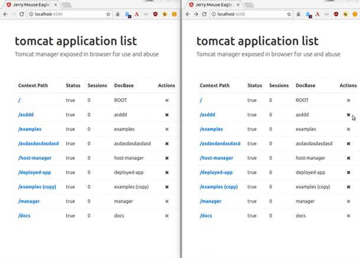

# open tomcat manger web ui [](https://travis-ci.org/golonzovsky/eagle-eye)
Tomcat manager ui for navigating and undeploying apps.
Mostly just playground for fullstack project on spring-boot, angular4, bootstrap4, SSE, websockets, docker, travis..  



### todo 
- [x] undeploy action
- [x] unactive list
- [x] 'remove item' animation and action
- [x] bundled .jar
- [x] SSE update list on undeploy
- [x] SSE reconnect
- [ ] websocket/SSE update list on new apps. cron polling tomcat for changes? maybe spring-integration inboundAdapter poller
- [x] docker `docker run -p 127.0.0.1:80:8181 golonzovsky/eagle-eye`
- [x] docker compose
- [x] travis build
- [ ] travis push docker image to hub
- [ ] set client api url to / on bundled .jar 
- [ ] compose setup with separate backend and frontend in different containers + CORS 
- [ ] spring WebFlux instead of MVC on reactive-web from boot 2.0
- [ ] spring asciidocs? 
- [ ] github oauth login

### Useful tooling

```
~ $ curl localhost:8181/sse-stream
event:undeploy
data:/asddd

event:undeploy
data:/asdasdasdasdasd

event:undeploy
data:/host-manager

event:undeploy
data:/examples (copy)

event:undeploy
data:/deployed-app
```

```
~ $ curl -s localhost:8181/apps | jq
[
  {
    "contextPath": "/",
    "docBase": "ROOT",
    "running": true,
    "sessions": 0,
    "readonly": true
  },
  {
    "contextPath": "/asddd",
    "docBase": "asddd",
    "running": true,
    "sessions": 0,
    "readonly": false
  },
...
```

### Links and resources
- [Spring Tips: Server Sent Events (SSE) in Spring MVC and Spring WebFlux](https://www.youtube.com/watch?v=2To3_mYT2hc)
- [HPBN: SSE](https://hpbn.co/server-sent-events-sse/)
- [From Zero to Hero with Spring WebSocket](https://www.youtube.com/watch?v=nxakp15CACY)
- [Deep dive into Spring WebSockets](https://www.youtube.com/watch?v=oCAC2yow8xk)
- [Angular and Angular CLI Demo](https://github.com/mraible/ng-demo/)
